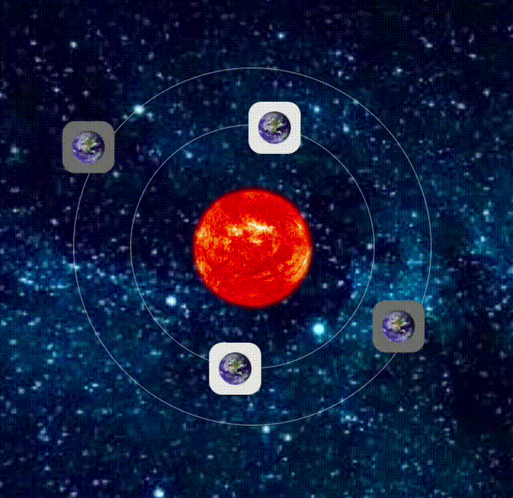

# 🌌 Solar System - CSS Animation

This is a small CSS animation project that simulates a solar system using HTML, CSS, and LESS. The planets (or icons) rotate around the sun (you can add a logo), creating a dynamic and visually interesting effect.

## 🚀 Technologies Used  
- HTML5  
- CSS3  
- LESS  

## 🎬 Preview  

## 📦 How to Use  

1. Clone this repository: `git clone https://github.com/jaquelinedesouzapaoli/cssAnimation.git`
2. Navigate to the project directory: `cd projectname`
3. Install LESS if you haven’t already: `npm install -g less`
4. After making changes to the `.less` file, compile the LESS file to CSS: `lessc stylesheet.less stylesheet.css`
